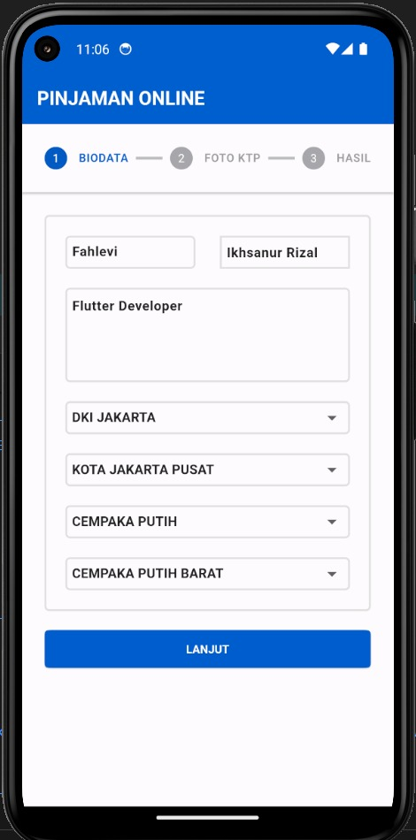
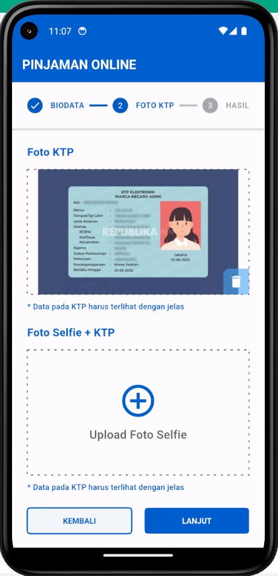
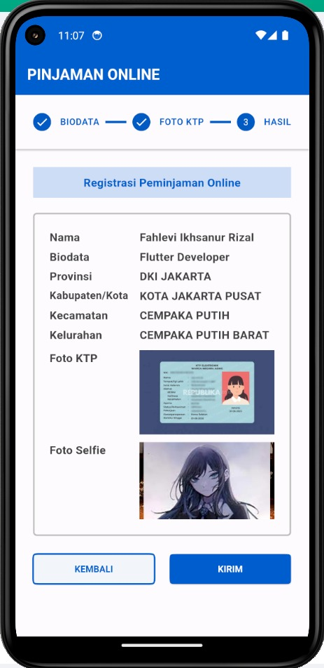

# Pinjaman Online App

Aplikasi pinjaman online menyediakan solusi finansial cepat dan mudah dengan
memanfaatkan teknologi digital. Pengguna dapat mengajukan pinjaman secara
langsung melalui aplikasi tanpa perlu mengunjungi kantor fisik. Proses
persetujuan yang cepat, persyaratan minimal, dan penggunaan algoritma kredit
inovatif memungkinkan pengguna untuk mendapatkan dana pinjaman dalam waktu
singkat. Aplikasi ini memberikan kenyamanan dan aksesibilitas dalam mengelola
kebutuhan keuangan sehari-hari tanpa ribet.

## User Interface

 

## Package and API

Package-package yang digunakan dalam aplikasi:

- [get](https://pub.dev/packages/get)
- [dropdown_button2](https://pub.dev/packages/dropdown_button2)
- [dio](https://pub.dev/packages/dio)
- [dashed_line](https://pub.dev/packages/dashed_line)
- [image_picker](https://pub.dev/packages/image_picker)
- [full_screen_image](https://pub.dev/packages/full_screen_image)
- [mime](https://pub.dev/packages/mime)
- [http_parser](https://pub.dev/packages/http_parser)

API yang dipakai untuk wilayah di Indonesia
[emsifa](https://github.com/emsifa/api-wilayah-indonesia)

Terima kasih~
